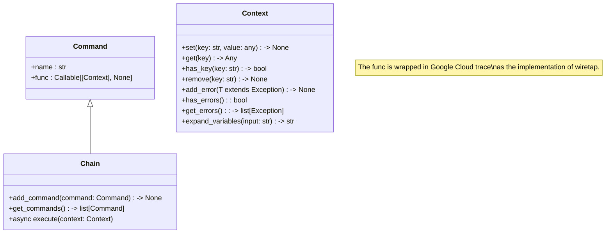

# Understanding workflows

## High Performance Compute and Parallelism vs Threads

Parallelism involves dividing a task into smaller subtasks that execute simultaneously,
often on multiple cores or machines, to reduce overall execution time. Threading 
is a specific implementation of parallelism where multiple threads, lightweight units 
of execution, run concurrently within a single process. While threading enables concurrency, 
it can be limited by the Global Interpreter Lock (GIL) in some languages, restricting 
true parallelism. Parallelism and efficient threading are crucial in high-performance
computing because they enable applications to leverage the full potential of modern 
multi-core processors and distributed systems, significantly accelerating complex
computations and handling large datasets.

## Patterns

* The **Chain of Responsibility** pattern passes a request along a chain of handlers, each of which decides 
either to handle the request or to pass it to the next handler in the chain. This avoids coupling the 
sender of a request to its receiver by giving multiple objects a chance to handle the request.
* The **Command** pattern encapsulates a request as an object, thereby allowing for parameterizing 
clients with queues, requests, and operations. It decouples the object that invokes the operation
from the one that knows how to perform it.
* The **Wiretap**  intercepts and examines data flowing through a system without altering its primary flow.
It's used for monitoring, debugging, or auditing purposes by passively observing data transmissions.

